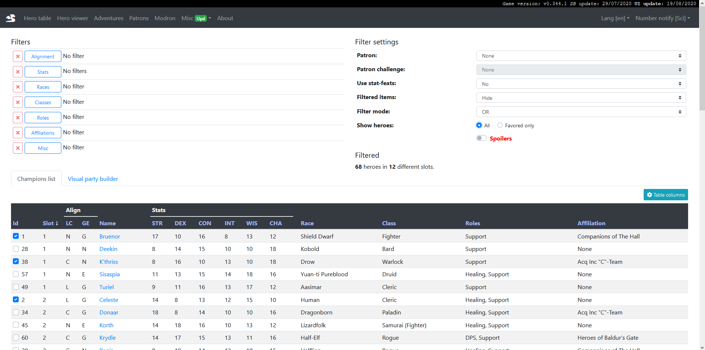
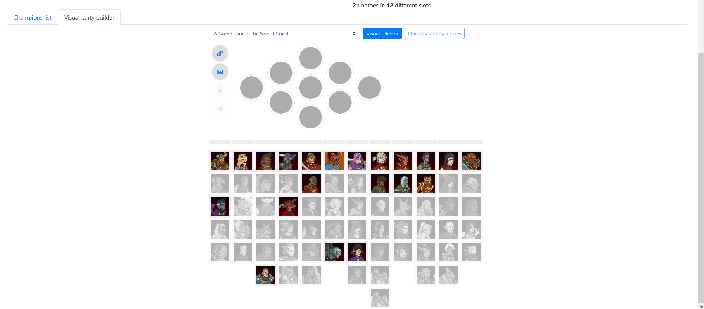
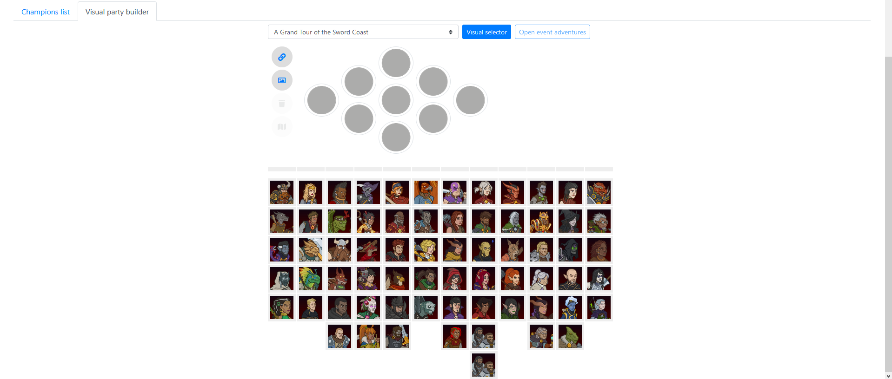

# Guide to using Kleho's site
A small guide for players of Idle Champions on using the incredibly helpful resource of Kleho's site

This guide utilises Kleho's site: https://idle.kleho.ru

## Quick Links
* [Selecting Your Champion Pool](#selecting-your-champion-pool)
* [Sharing Your Champion Pool](#sharing-your-champion-pool)
* [Building a Formation](#building-a-formation)
* [Sharing a Formation](#sharing-a-formation)

## Selecting Your Champion Pool
On Kleho's site navigate to the "Hero Table" the first item on the navigation bar. This page has lots of ways to filter champions based on their attributes but for our purposes we won't be using those here. You will notice under all the filters a large text-based table of heroes, here in the far-left column is where you should tick each box for each champion you own.

After selecting your unlocked champions you will want to make use of the "Show heroes" filter; change it to "Favored only" (you will need to switch this back to "all" if you unlock more champions and need to select them from the list). After doing so select the "Visual Party Builder" tab and it should look something like this:

## Sharing Your Champion Pool
After following the directions to select your champion pool you can now share it.

* For Windows Users:
  * Use the short-cut: WindowsKey+Shift+S this will allow you to click and drag a box over the area you wish to share and the screenshot will be saved to your clipboard where you can directly paste it into wherever you wish to share e.g. Discord

* For Mac Users:
  * Use the shortcut Shift+Command+4 this will then save the screenshot of the selected area to your desktop where you can then upload it directly to where you want to share it e.g. Discord

## Building a Formation
With or without your unlocked heroes selected you can build a formation. Navigate to the "Hero Table" portion of the website and select the "Visual Party Builder Tab"

From here you can select the formation layout from the dropdown or use the visual selector to find the correct one for the campaign you are running. With the layout selected you can simply click and drag the champion portraits around to place them in the formation and swap them around within it.

## Sharing a Formation
With a formation built simply click the hyperlink button to the top-left of your formation to get the link to its image saved to your clipboard, the link will be something like this: https://idle.kleho.ru/assets/fb/2/10_53_2_48_4_9_13_65_5_38.png

Then all you need to do is paste the link wherever it is you are sharing your formation
