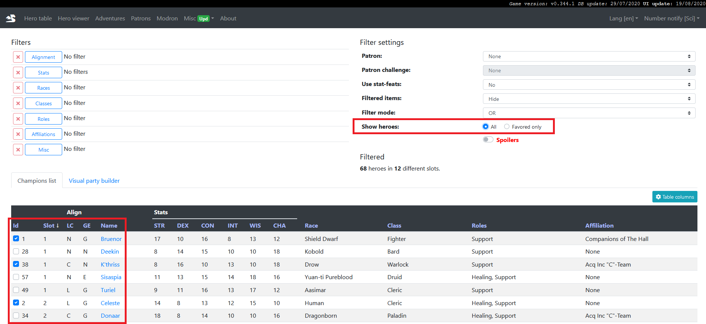

# Guide to using Kleho's site
A small guide for players of Idle Champions on using the incredibly helpful resource of Kleho's site

This guide utilises Kleho's site: https://idle.kleho.ru

## Quick Links
* [Selecting Your Champion Pool](#selecting-your-champion-pool)
* [Sharing Your Champion Pool](#sharing-your-champion-pool)
* [Building a Formation](#building-a-formation)
* [Sharing a Formation](#sharing-a-formation)

## Selecting Your Champion Pool
On Kleho's site navigate to the "Hero Table" the first item on the navigation bar. This page has lots of ways to filter champions based on their attributes but for our purposes we won't be using those here. You will notice under all the filters a large text-based table of heroes, here in the far-left column is where you should tick each box for each champion you own.

After selecting your unlocked champions you will want to make use of the "Show heroes" filter; change it to "Favored only" (you will need to switch this back to "all" if you unlock more champions and need to select them from the list). After doing so select the "Visual Party Builder" tab and it should look something like this:

## Sharing Your Champion Pool

## Building a Formation

## Sharing a Formation
